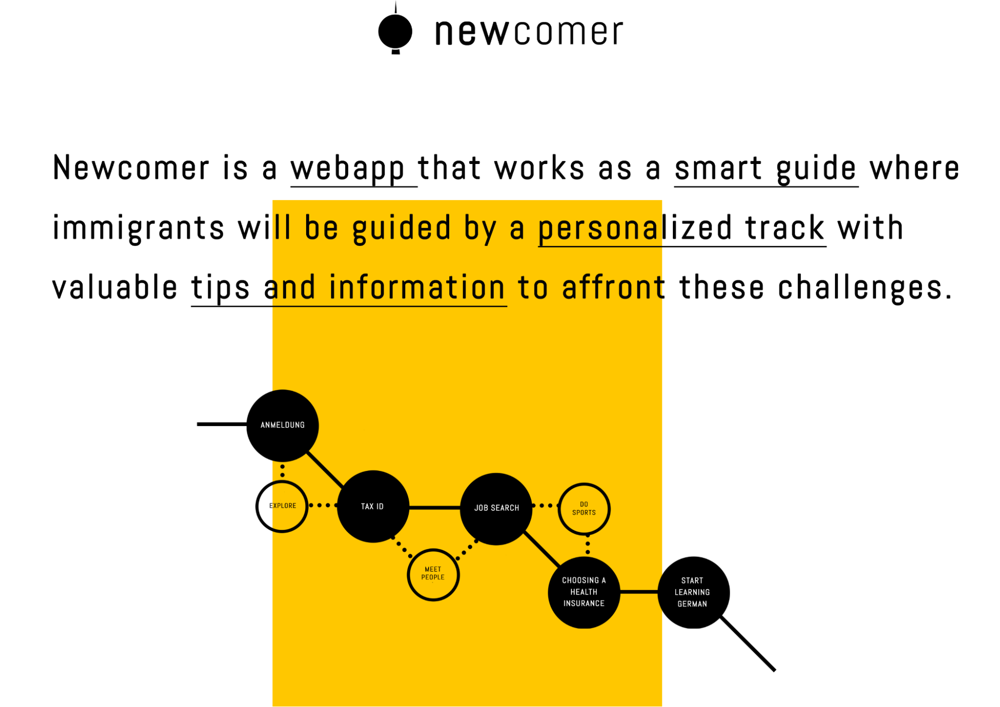
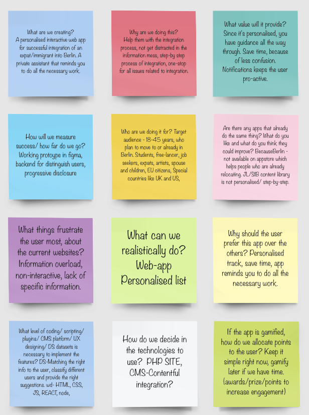
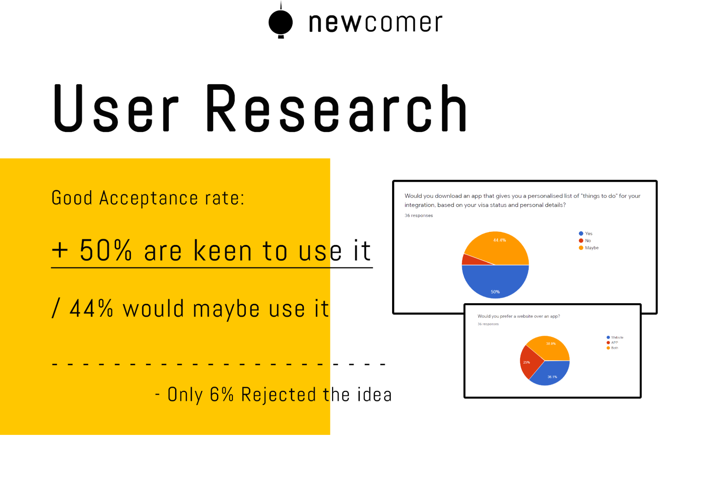
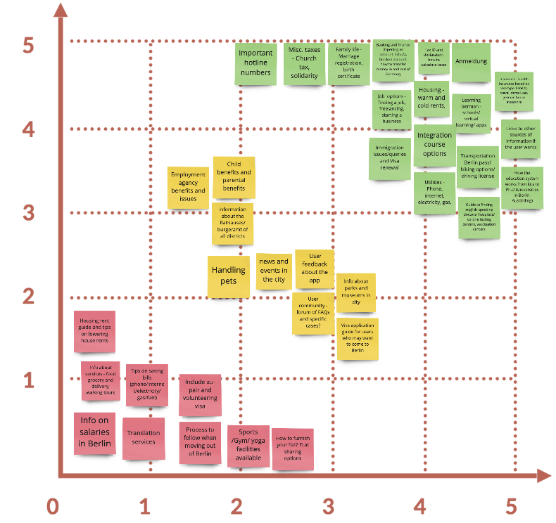
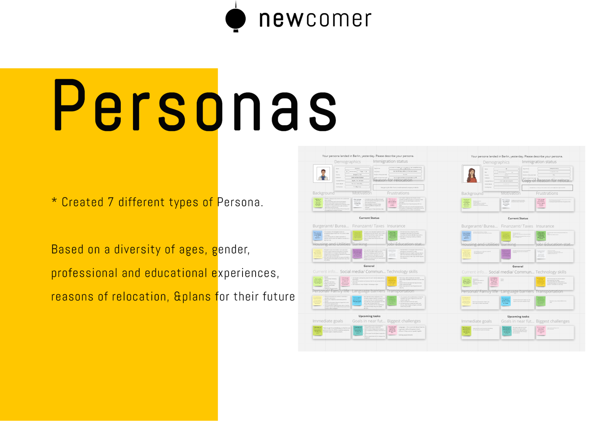

Newcomer: A guide for new Berliners
# Table of Contents
  * [0.1 Introduction](#introduction)
  * [0.2 User Research results](#user-research-results)
  * [0.3 We also created a priority list of categories to be included based on the user research results.](#we-also-created-a-priority-list-of-categories-to-be-included-based-on-the-user-research-results.)
  * [0.4 Content and information architecture](#content-and-information-architecture)
  * [0.5 Branding and Visual Design](#branding-and-visual-design)
  * [0.6 All the illustrations were created using Adobe illustrator and animated using Adobe XD.](#all-the-illustrations-were-created-using-adobe-illustrator-and-animated-using-adobe-xd.)
  * [0.7 Usability Testing](#usability-testing)
  * [0.8 Challenges and Pain Points.](#challenges-and-pain-points.)
  * [0.9 Coding and Development](#coding-and-development)
  * [0.10 Future plans and other considerations about the project](#0.10-future-plans-and-other-considerations-about-the-project)
  * [0.11 Conclusion](#0.11-conclusion)
## 0.1 Introduction
The idea of the project Newcomer is a result of multiple conversations with immigrants and expats in Berlin who were puzzled about the German Bureaucracy and opportunities in terms of work contracts. In one such conversation, a simple question arose: “Is it possible to get a mini-job contract while holding a freelancer visa?”. The answer to this question is quite tricky as it depends on each particular case and Nationality. To answer the question, yes, it is possible to be a freelancer and work in a mini-job at the same time if you have relocated from other EU countries- a status that gives them special rights and benefits. However, people from outside the EU that hold a free-lancer visa are not allowed - at the beginning - to get a work contract until they get a permanent residency. If the expat is unaware of this rule and starts working, it might provide the authorities enough reason to void a valid visa. In order to avoid any confusion, many immigrants do not risk taking a mini-job. The Newcomer web-app aims at providing solutions to these puzzling ambiguities. 

The initiative behind Newcomer was to create an app that presents the user with a simple straight-forward explanation of their rights, tasks, benefits, and obligations, both before and after coming to Berlin. After signup, the user is provided a personalized track to decipher the different challenges that pop-up during their visa application and city integration process. The app guides them to create a routine that will make them confident enough to triumph over the bureaucratic hassles after their arrival. For increased user engagement, the entire app is gamified, right from the option of selecting avatars, progressing through different levels of bureaucratic hierarchy and playing games that educate the user of the notorious Berlin scams or deals, for some entertainment.

We started by having multiple brainstorming sessions to seek answers to relevant questions like - “what can be realistically done in one month, with our given skillset?, “what value will the app provide?” “Are other apps doing the same thing?” and many more. All of these sessions were conducted on Miro. 

Since we had a limited amount of time during our boot camp and the entire concept is quite extensive, we decided to shrink the scope of our project to focus on creating the web version of the app. The MVP was limited to creating an app to help expats succeed in their integration process in Berlin by providing a better understanding of its rules, dynamics, and culture.

Since we couldn't find other apps with the same concept, we looked at other learning and habit-development apps like Duolingo, Primer, Grasshopper, Educated for some inspiration. This process helped us to have a better understanding of user flows, the importance of having a “dashboard” as a welcome page, a clear user interface, and a recognizable learning path for the user.

## 0.2 User Research results
In order to have a better understanding of user needs, we decided to conduct research by doing a google forms survey. The main objective of the research was to unearth all the possible obstacles that potential users might experience during their relocation and integration to Berlin. We included questions related to their age, level of education, current visa conditions, the reason for relocation, and their biggest challenges with respect to each type of bureaucratic task, right from getting an Anmeldung to filing their tax returns. The survey was posted on several Facebook and slack groups. The survey link can be found here - 
https://docs.google.com/forms/d/1QXvXLfDtqEMiG8g1Xeez3AkgIrAQpxcvZQsr9FoZaxo/edit

Among the survey responses, we can highlight the fact that 65% of the participants passed through a visa application process and 36% of them consider it as a difficult process. Another aspect to highlight is the diversity of age, nationalities, visa types, and reasons for relocation of the respondents. 

In terms of simple challenges of integration, more than 24% percent affirmed that they had problems making their city registration (Anmeldung) and more than 50% informed problems at the moment of opening a bank account in Germany. Also, another result shows that 80% of the respondents still have issues understanding how the german tax system works.

The second objective of the survey was to know if the people were interested in downloading and testing an app that would help them to solve these everyday challenges. The results show that around 50% of the respondents are keen to download an app of this type, 44% might download it, and just 6% said they are not interested in it. Also, it is important to say that 45% percent of the users wouldn’t mind using both the app and a website to find help on these matters.

We also created a priority list of categories to be included based on the user research results. In general, the research provided the expected results and gave the team a better perspective about the potential user difficulties and challenges during their integration to Berlin. It was decided that the major pain points related to Anmeldung, housing and utilities, health insurance, transportation, and taxes would be included in the first phase of the project.

Personas and Case scenarios
Considering the diversity of our potential users, we decided to create multiple models of personas based on their demographics, immigration status, and also motivations, and frustrations about their lives in Berlin. The personas included the demographics and immigration status of the user, along with his immediate goals, upcoming tasks, and biggest challenges. All the personas can be found here - 
 https://miro.com/app/board/o9J_lK_gqVQ=/ 

The different outcomes from this process lead us to think on different possible case scenarios that could result in personalized tracks for each of them: For example, A foreign freelancer that prioritizes its duties with the tax office and yearly tax declarations, an Ausbildung student would need to improve his/her/their German skills and find a Praktikum, a young professional that is looking for job opportunities in Berlin would have to adapt the CV to the local job market. Generating multiple personas helped us create progressive disclosure of user flows for different scenarios. 

