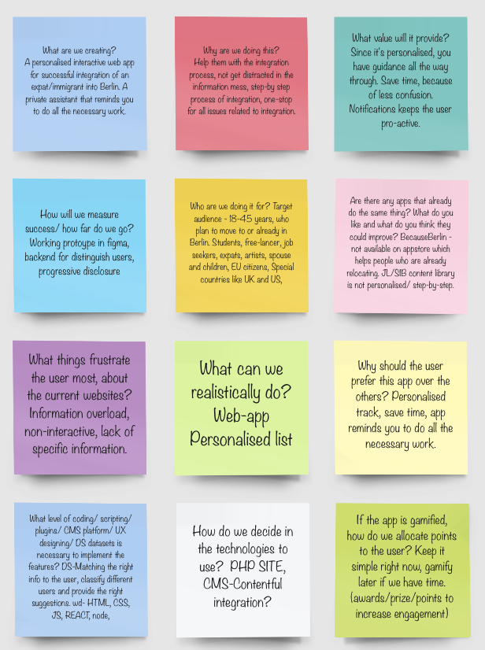

Newcomer: A guide for new Berliners
# Table of Contents
  * [0.1 Introduction](#introduction)
  * [0.2 User Research results](#user-research-results)
  * [0.3 We also created a priority list of categories to be included based on the user research results.](#we-also-created-a-priority-list-of-categories-to-be-included-based-on-the-user-research-results.)
  * [0.4 Content and information architecture](#content-and-information-architecture)
  * [0.5 Branding and Visual Design](#branding-and-visual-design)
  * [0.6 All the illustrations were created using Adobe illustrator and animated using Adobe XD.](#all-the-illustrations-were-created-using-adobe-illustrator-and-animated-using-adobe-xd.)
  * [0.7 Usability Testing](#usability-testing)
  * [0.8 Challenges and Pain Points.](#challenges-and-pain-points.)
  * [0.9 Coding and Development](#coding-and-development)
  * [0.10 Future plans and other considerations about the project](#0.10-future-plans-and-other-considerations-about-the-project)
  * [0.11 Conclusion](#0.11-conclusion)
## 0.1 Introduction
The idea of the project Newcomer is a result of multiple conversations with immigrants and expats in Berlin who were puzzled about the German Bureaucracy and opportunities in terms of work contracts. In one such conversation, a simple question arose: “Is it possible to get a mini-job contract while holding a freelancer visa?”. The answer to this question is quite tricky as it depends on each particular case and Nationality. To answer the question, yes, it is possible to be a freelancer and work in a mini-job at the same time if you have relocated from other EU countries- a status that gives them special rights and benefits. However, people from outside the EU that hold a free-lancer visa are not allowed - at the beginning - to get a work contract until they get a permanent residency. If the expat is unaware of this rule and starts working, it might provide the authorities enough reason to void a valid visa. In order to avoid any confusion, many immigrants do not risk taking a mini-job. The Newcomer web-app aims at providing solutions to these puzzling ambiguities. 

The initiative behind Newcomer was to create an app that presents the user with a simple straight-forward explanation of their rights, tasks, benefits, and obligations, both before and after coming to Berlin. After signup, the user is provided a personalized track to decipher the different challenges that pop-up during their visa application and city integration process. The app guides them to create a routine that will make them confident enough to triumph over the bureaucratic hassles after their arrival. For increased user engagement, the entire app is gamified, right from the option of selecting avatars, progressing through different levels of bureaucratic hierarchy and playing games that educate the user of the notorious Berlin scams or deals, for some entertainment.

We started by having multiple brainstorming sessions to seek answers to relevant questions like - “what can be realistically done in one month, with our given skillset?, “what value will the app provide?” “Are other apps doing the same thing?” and many more. All of these sessions were conducted on Miro. 

