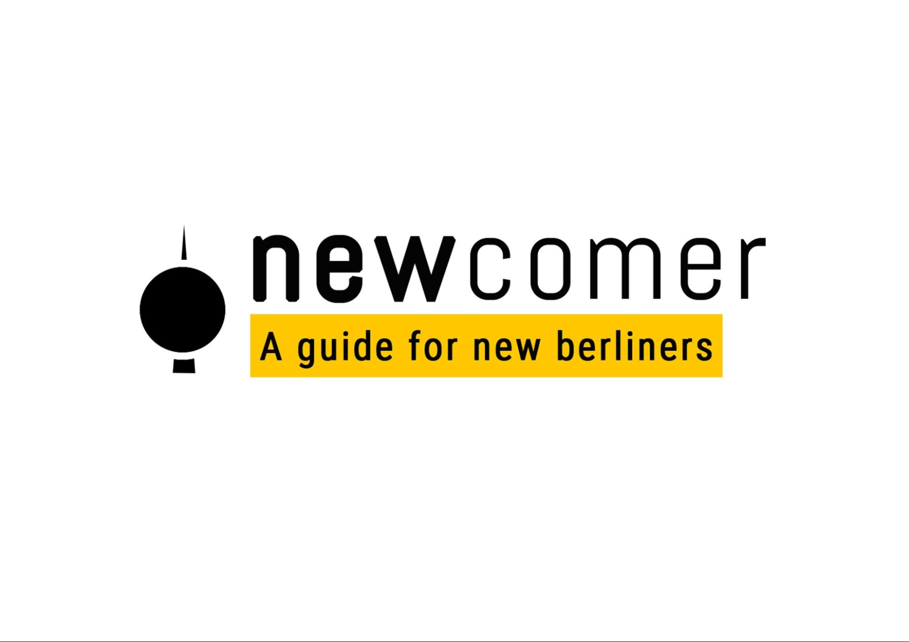

Newcomer: A guide for new Berliners

# Table of Contents
  * [0.1 Introduction](#introduction)
  * [0.2 User Research results](#user-research-results)
  * [0.3 We also created a priority list of categories to be included based on the user research results.](#we-also-created-a-priority-list-of-categories-to-be-included-based-on-the-user-research-results.)
  * [0.4 Content and information architecture](#content-and-information-architecture)
  * [0.5 Branding and Visual Design](#branding-and-visual-design)
  * [0.6 All the illustrations were created using Adobe illustrator and animated using Adobe XD.](#all-the-illustrations-were-created-using-adobe-illustrator-and-animated-using-adobe-xd.)
  * [0.7 Usability Testing](#usability-testing)
  * [0.8 Challenges and Pain Points.](#challenges-and-pain-points.)
  * [0.9 Coding and Development](#coding-and-development)
  * [0.10 Future plans and other considerations about the project](#0.10-future-plans-and-other-considerations-about-the-project)
  * [0.11 Conclusion](#0.11-conclusion)
