Newcomer: A guide for new Berliners
# Table of Contents
  * [0.1 Introduction](#introduction)
  * [0.2 User Research results](#user-research-results)
  * [0.3 Personas and Case scenarios](#-0.3-personas-and-case-scenarios)
  * [0.4 Customer Journey Map](#customer-journey-map)
  * [0.5 Content and information architecture](#content-and-information-architecture)
  * [0.6 Branding and Visual Design](#branding-and-visual-design)
  * [0.7 Wire-framing/ Lo-fi Prototyping](#wire-framing/-lo-fi-prototyping)
  * [0.8 Gamification](#gamification)
  * [0.9 Usability Testing](#usability-testing)
  * [0.10 Coding and Development](#0.10-coding-and-development)
  * [0.11 Challenges and Pain Points](#0.11-challenges-and-pain-points)
  * [0.12 Future plans and other considerations about the project](#0.12-future-plans-and-other-considerations-about-the-project)
  * [0.13 Conclusion](#0.13-conclusion)

Newcomer:A Guide for New Berliners

  
**0.1 Introduction**
The idea of the project Newcomer results from multiple conversations with immigrants and expats in Berlin who were puzzled about the German Bureaucracy and opportunities in terms of work contracts. In one such conversation, a simple question arose: “Is it possible to get a mini-job contract while holding a freelancer visa?”. The answer to this question is quite tricky as it depends on each particular case and nationality. To answer the question, yes, it is possible to be a freelancer and work in a mini-job at the same time if you have relocated from other EU countries- a status that gives them special rights and benefits. However, people from outside the EU that hold a free-lancer visa are not allowed - at the beginning - to get a work contract until they get a permanent residency. If the expat is unaware of this rule and starts working, it might provide the authorities enough reason to void a valid visa. To avoid any confusion, many immigrants do not risk taking a mini-job. The Newcomer web app aims at providing solutions to these puzzling ambiguities. 

The initiative behind Newcomer was to create an app that presents the user with a simple straight-forward explanation of their rights, tasks, benefits, and obligations, both before and after coming to Berlin. After signup, the user is provided a personalized track to decipher the different challenges that pop-up during their visa application and city integration process. The app guides them to create a routine that will make them confident enough to triumph over the bureaucratic hassles after their arrival. For increased user engagement, the entire app is gamified, right from the option of selecting avatars, progressing through different levels of bureaucratic hierarchy and playing games that educate the user of the notorious Berlin scams or deals, for some entertainment.

We started by having multiple brainstorming sessions to seek answers to relevant questions like - “what can be realistically done in one month, with our given skillset?, “what value will the app provide?” “Are other apps doing the same thing?” and many more. All of these sessions were conducted on Miro. 

Since we had a limited amount of time during our boot camp and the entire concept is quite extensive, we decided to shrink the scope of our project to focus on creating the web version of the app. The MVP was limited to creating an app to help expats succeed in their integration process in Berlin by providing a better understanding of its rules, dynamics, and culture.

Since we couldn't find other apps with the same concept, we looked at other learning and habit-development apps like Duolingo, Primer, Grasshopper, Educated for some inspiration. This process helped us to have a better understanding of user flows, the importance of having a “dashboard” as a welcome page, a clear user interface, and a recognizable learning path for the user.

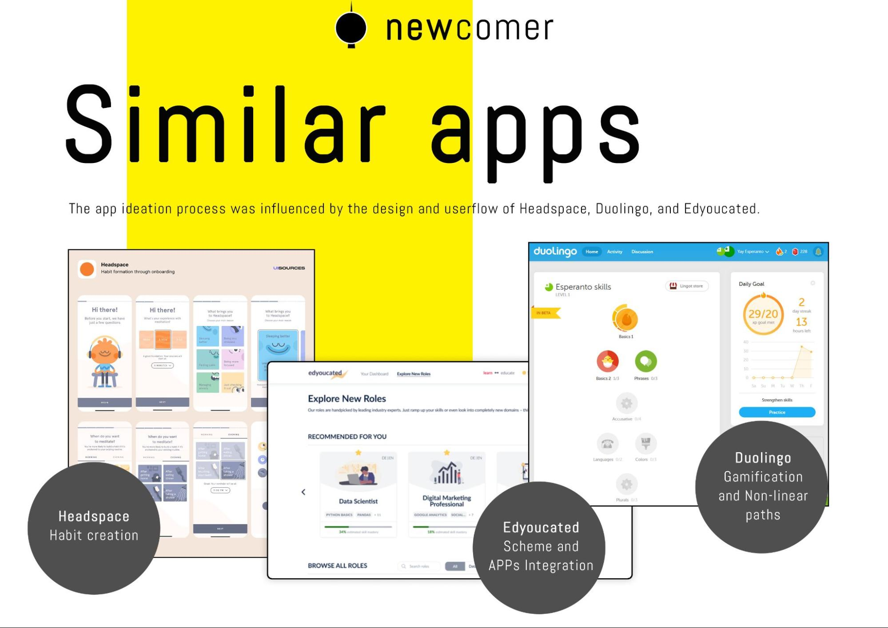

**0.2 User Research results**
In order to have a better understanding of user needs, we decided to conduct research by doing a google forms survey. The main objective of the research was to unearth all the possible obstacles that potential users might experience during their relocation and integration to Berlin. We included questions related to their age, level of education, current visa conditions, the reason for relocation, and their biggest challenges with respect to each type of bureaucratic task, right from getting an Anmeldung to filing their tax returns. The survey was posted on several Facebook and slack groups. The survey link can be found here - 
https://docs.google.com/forms/d/1QXvXLfDtqEMiG8g1Xeez3AkgIrAQpxcvZQsr9FoZaxo/edit

Among the survey responses, we can highlight the fact that 65% of the participants passed through a visa application process and 36% of them consider it as a difficult process. Another aspect to highlight is the diversity of age, nationalities, visa types, and reasons for relocation of the respondents. 

In terms of simple challenges of integration, more than 24% percent affirmed that they had problems making their city registration (Anmeldung) and more than 50% informed problems at the moment of opening a bank account in Germany. Also, another result shows that 80% of the respondents still have issues understanding how the german tax system works.

The second objective of the survey was to know if the people were interested in downloading and testing an app that would help them to solve these everyday challenges. The results show that around 50% of the respondents are keen to download an app of this type, 44% might download it, and just 6% said they are not interested in it. Also, it is important to say that 45% percent of the users wouldn’t mind using both the app and a website to find help on these matters.

We also created a priority list of categories to be included based on the user research results. In general, the research provided the expected results and gave the team a better perspective about the potential user difficulties and challenges during their integration to Berlin. It was decided that the major pain points related to Anmeldung, housing and utilities, health insurance, transportation, and taxes would be included in the first phase of the project.

**0.3 Personas and Case scenarios**

Considering the diversity of our potential users, we decided to create multiple models of personas based on their demographics, immigration status, motivations, and frustrations about their lives in Berlin. The personas included the demographics and immigration status of the user, along with his immediate goals, upcoming tasks, and most significant challenges. All the personas can be found here - 
 https://miro.com/app/board/o9J_lK_gqVQ=/ 

The different outcomes from this process lead us to think on different possible case scenarios that could result in personalized tracks for each of them: For example, A foreign freelancer that prioritizes its duties with the tax office and yearly tax declarations, an Ausbildung student would need to improve his/her/their German skills and find a Praktikum, a young professional that is looking for job opportunities in Berlin would have to adapt the CV to the local job market. Generating multiple personas helped us create progressive disclosure of user flows for different scenarios. 

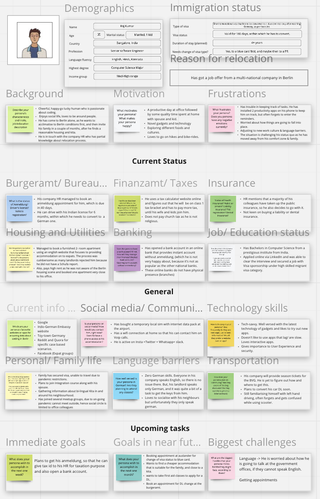

**0.4 Customer Journey Map**

If the user were to come across our app and use it, we need to have an understanding of the channels through which the user interacts and his emotions at the given time. We created a simple customer journey map, filling ourselves in the user’s shoes, and essaying what would be the user’s goals, assumptions, expectations, pain points, emotions, thoughts, problems, and opportunities, in each phase of the app-use - right from the time he discovers the app, to the time he uses it, to the downtime and support and finally deletion. 

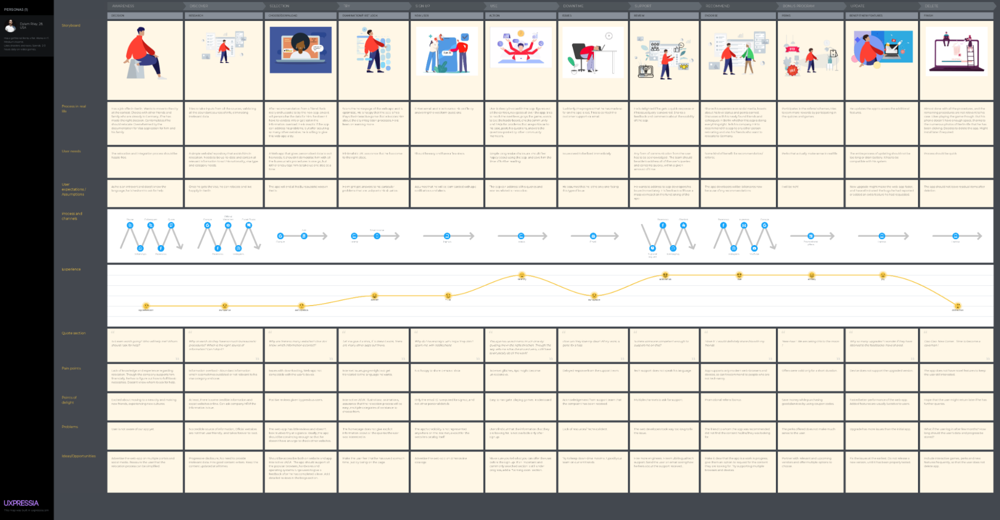

**0.5 Content and information architecture**

Due to the scope of the project and its “personalized track” feature, it is of utmost importance that the content is thoroughly organized. Since the entire project is based on progressive disclosure, we used all the possible case scenarios for each user depending on his nationality and age and designed the information architecture vast enough to suit our app needs. It was decided that the content flows would be defined by conditional logic trying not to exclude any particular case. Further, we developed user-flows to suit every type of long-term visas, nationality, age, profession. If the user is not yet in Berlin, they will be provided tips for securing the visa and some assistance with the pre-departure relocation tasks. If they are already in Berlin, they will be encouraged to take up the bureaucratic responsibilities, one at a time. The entire architecture can be found here
https://miro.com/app/board/o9J_lK_gqVQ=/

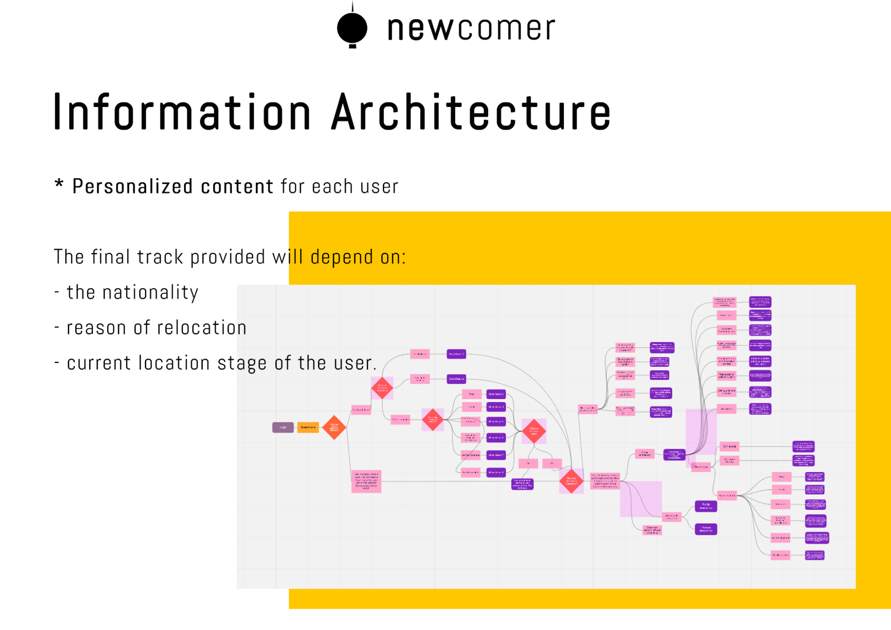

**0.6 Branding and Visual Design**

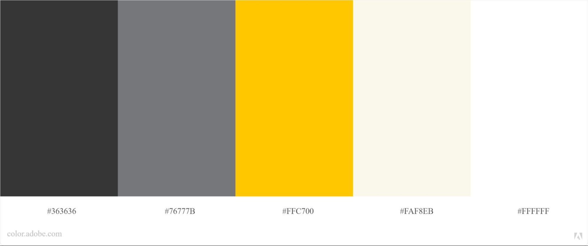
To have maximum user engagement, we then started to work on the visual aspects of the app before creating our prototype. Multiple versions of the logo, taglines, and color palettes were generated and iterated. Our objective was to create a brand identity that was connected to Berlin and its cultural identity. We finally decided to include multiple shades of the black, white, and yellow colors, taking reference from Berlin’s transport system and Alexanderplatz TV tower.

**0.7 Wire-framing/ Lo-fi Prototyping**
We created multiple lo-fi frames to ease the user flow and conducted basic usability testing among the team members to check the most feasible user flow. 
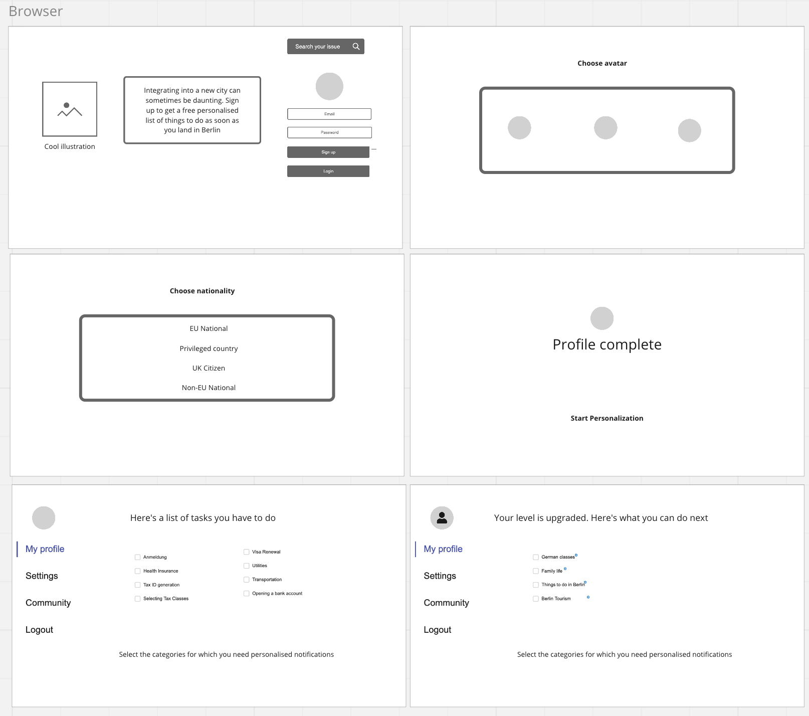

It was followed by creating a working Figma prototype of the web app. The significant components like buttons, checkboxes, color-palette, icons, fonts, and all its variants were created as a first step. Then we made the first three pages- i.e., the “log in/signup,” the “select your profile page,” and the “profile complete” page. After a couple of iterations and brainstorming sessions, we then started to design the user flow to suit each type of user. The user is greeted with an illustration and can sign-up. He gets to choose an avatar and sets up his profile by selecting his nationality. Then he gets to choose his personalized track depending on whether the user is already in Berlin or yet to reach Berlin. The data presented to the user is in the form of progressive disclosure. The UI progresses naturally, from simple to complex, and does not overburden the user. Because the information presented to someone who isn't interested in it or isn't ready to process it - is noise.  

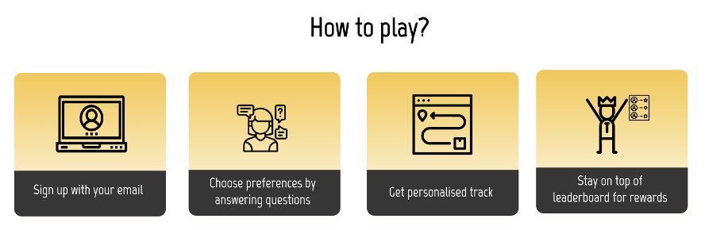
After finishing each task, he can mark the task as complete to earn some virtual beer/drink/points. The higher the tasks completed, the higher the chance to top the leaderboard.

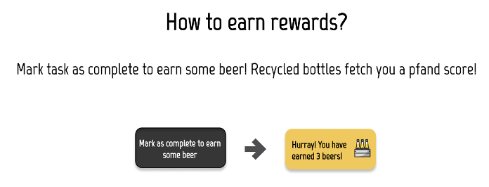
In addition, to gain additional points, the user can participate in activities at the end of each category or play the game Newcomer v/s Berlin 1.1. The activity generally includes a simple quiz related to the task that the user has chosen.

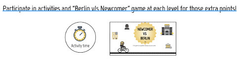

Taking inspiration from the German recycling systems, we created a points system wherein the user virtually recycles the drink bottles to get a final “Pfand” score. The user gets a chance to buy different items from the “Pfand” accumulated, starting from a carton of milk up to becoming the mayor of Berlin.

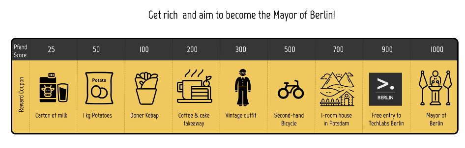

As he progresses through the levels, he is presented with tracks to choose from. And with each progression of level, his avatar icon on the sidebar gets upgraded from being a tourist - to an expat - to a Real-Berliner. 

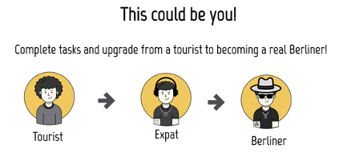

The entire Figma prototype can be found here:
https://www.figma.com/file/qkBzqBgYYqY36RExzKLNvh/Prototype?node-id=0%3A1

All the illustrations were created using Adobe Illustrator/Photoshop and animated using Adobe XD. The gifs were added into Figma files using Lottie files. 

0.8 Gamification
The Game Newcomer v/s Berlin 1.1 educates the user about the possible bureaucratic hassles and scams if he is not vigilant. On the other hand, if he is cautious enough, he gets awarded the best deals. The game was inspired by reminiscing about the childhood Mario game and the internet Dino game that would have entertained you at some point when the internet was down. To build the game, we used Axure Rp and added conditional logic wherein the user gets a shock after coming in contact with a notorious scam/hassle, thus resetting the score to zero. On the other hand, he gets bonus points for collecting a deal. The game prototype can be played here “https://rjnrgc.axshare.com/#id=1n33cu&p=page_1”

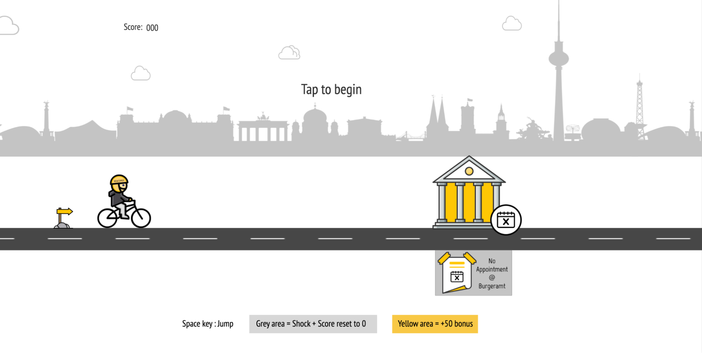

The user needs to overcome obstacles like ATM skimming, rental scam, or jaywalking.

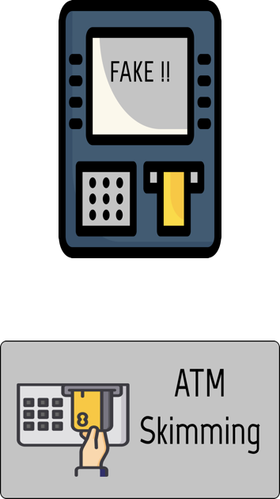
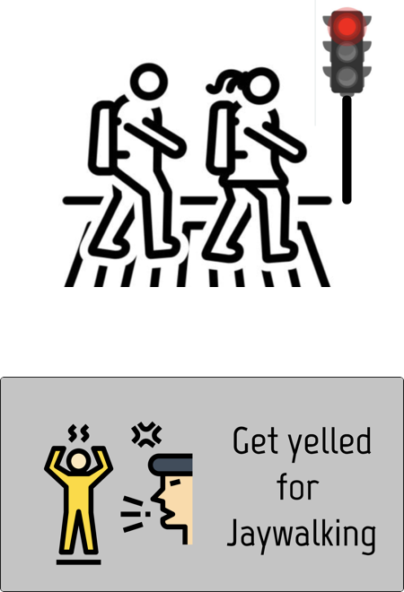
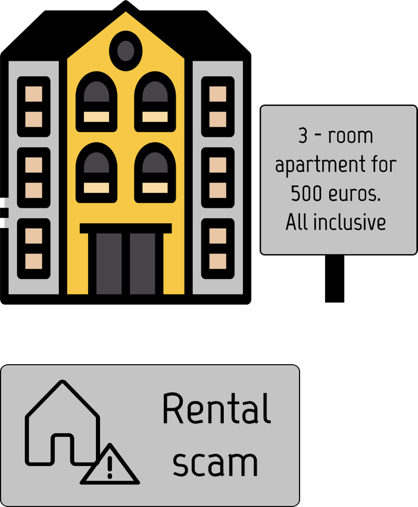
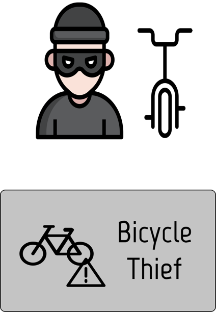

The user is awarded bonus points if he chooses a supermarket or online deal or recycles his trash.

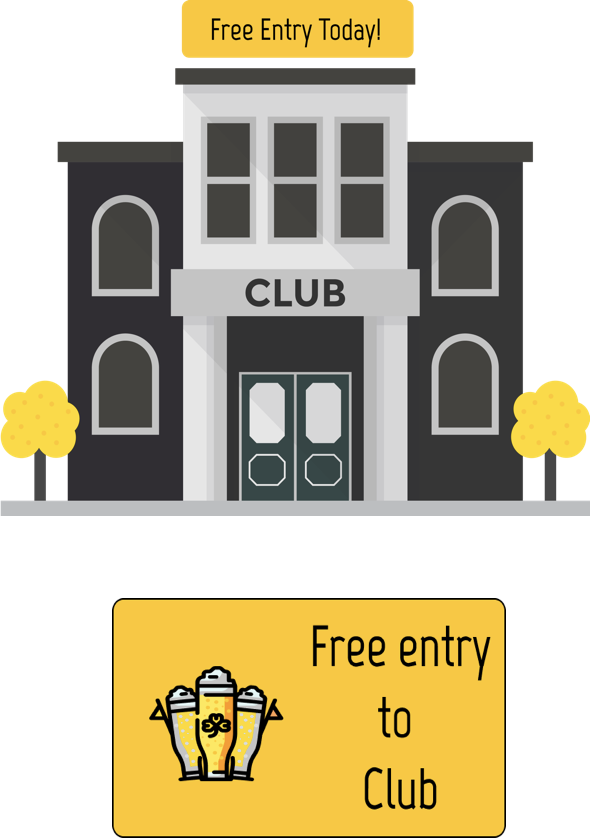
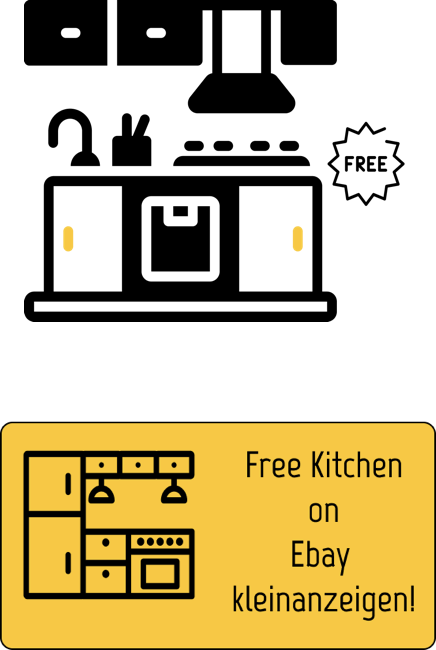
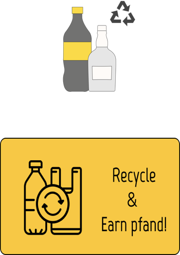
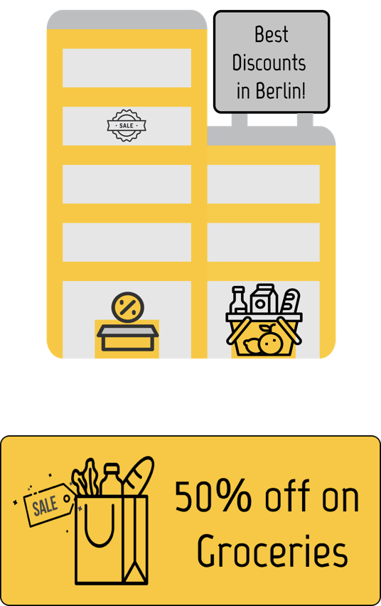

0.9 Usability Testing

To check the feasibility of the user-flow in our prototype, we conducted user feedback with Maze’s remote testing platform.

The test results analyzed using heat maps show that more than 99% of users can create a user profile without hassles. This is a positive outcome because, from a UX standpoint, we live in the age of information overload; a user is always burdened with tons of information and can be easily distracted.
The chances of making a mistake could be even higher as people don’t always see or read everything on the screen. We have tried to eliminate this by making the prototype more interactive and illustrative. 

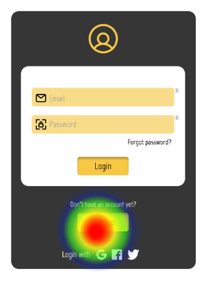
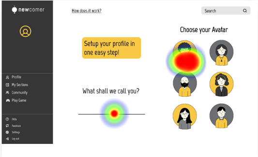
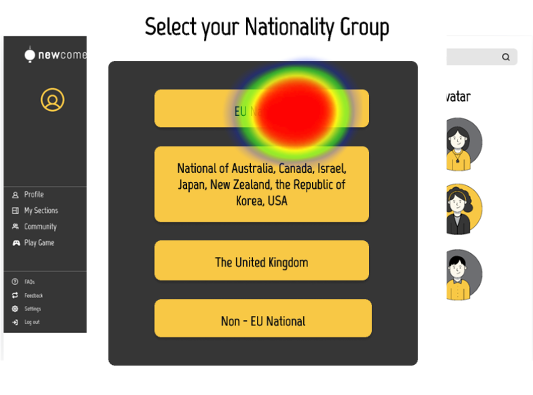

Since we were able to finish only the desktop version of the app, we weren’t able to check the responsiveness on different devices.

0.10 Coding and Development
The web development started with making a first version of the signup and login page with HTML 5 and CSS 3.

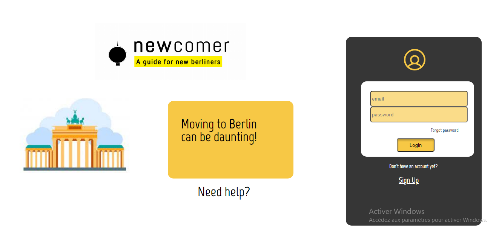
Once that was set up, we needed to think about the functionality and set up the back end, and we used the  Firebase authentication, which was linked to the project with Javascript.
The content was taken from the Miro board, which the UX team designed and conducted research for.

A very simple prototype was created, featuring some dynamic features such as uploading a profile picture, change a name (Saved in Firestore), an interactive set of questions to determine the visa (JSON Files), update the “Pfand” score through crossing off the different steps (gamification) and also some static pages with the most important steps to integrate into Berlin, which are accessible through the authentication process with Firebase.

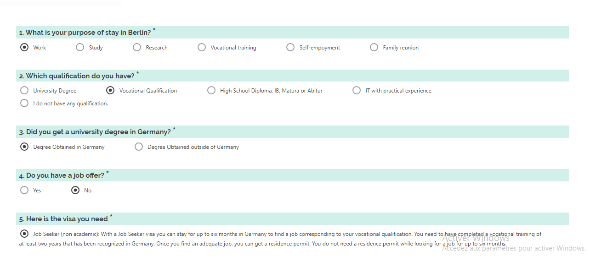

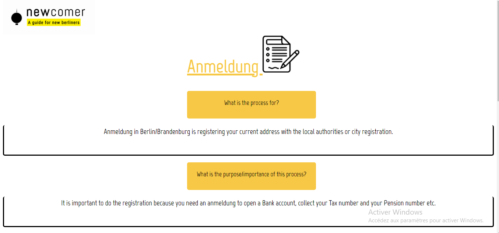

The web app is still underdeveloped, as more developers and content creators are needed. But in the future, the app could be deployed, the personalized track can be extended to the contents that the users want to see or not, along with quizzes and games. A better back-end and interaction with the database could also be developed. 

The goal is to develop a mobile app and a web app as close as the intended UX prototype, and as ideas come along, many more features should come.
0.11 Challenges and Pain Points
The challenges in the project were mainly related to the web development side. Unfortunately, the size of the web development team and the lack of advanced knowledge about the tools lead to some confusion at the moment of making decisions about the coding structure and back-end tools to be implemented. Fortunately, thanks to the help of Tech Labs coordinators and our new mentor, the WD team received the right advice and cleared the way to start to develop the web app. 
Two members of the team left the course during the project phase, making the team lose the members in charge of data science and the half of the team in charge of web development, creating not only a lack of data science approach but also generating a more considerable burden on the only member that left in charge of the coding and development phase. This made us reduce our project goals in web development, but we decided to try to make as much progress as possible.

0.12 Future plans and other considerations about the project
Though progress achieved during these last four months is considerable, many things are still to be considered to launch the web app. The first aspect to consider will be to rethink the project idea and content by including sociology, anthropology, and migrations science theory. Considering that the project has a social impact goal, as it involves immigrant/expat integration, is it mandatory to proceed with the ideation process taking into consideration concepts and theories from diverse social sciences such as Migratory process, types of migrations, migratory act, settlement, integration, inclusion, networking, globalization, etc. Knowing this discipline of studies will let us ideate under specific guidelines and create an adequate user flow and content. Also, theoretical frameworks from other fields could explore the historical, economic, and cultural aspects of the different migrations processes nowadays. 
The second thing to consider will be to recreate the prototype for a multi-platform responsive app suitable for both desktop and mobile formats. Finally, to succeed in its goals, the Newcomer should be accessible for all types of users and devices. Further, we need to add features that would foster user engagement, such as notifications and reminders. Finally, from an educational perspective, we need an appealing user interface to teach the learning habits to a new user to fulfill the necessary different challenges. 
Once the project is strategically reframed and developed, we would like to collaborate with other public and private sectors working in similar fields. We are conscious that projects with social impact are necessary to solve contemporary social issues such as the ones related to expat and immigrant integration.
0.13 Conclusion
The problem related to immigrants' social and cultural integration is a big challenge for almost every society. Therefore, providing access to the correct information about the system and its rules could be a key aspect in offering help to relocating individuals and their families in their arrival, further integration in their city of destination, and their success. Therefore, the social impact that this project might have has been a strong motivation for us to develop and execute it.

Another relevant aspect of the concept is its replicability. The app model could be developed in different cities and countries around the world. Our project is undoubtedly Berlin-oriented because the German capital attracts millions of people from the whole country and worldwide. In addition, the swift pace of gentrification and internationalization in the city makes a deep transformation in the social landscape, which presents new challenges to its development. To address these unconventional concerns and solve contemporary social challenges, innovative media and relevant technology with an efficient user interface will be of utmost importance. 

